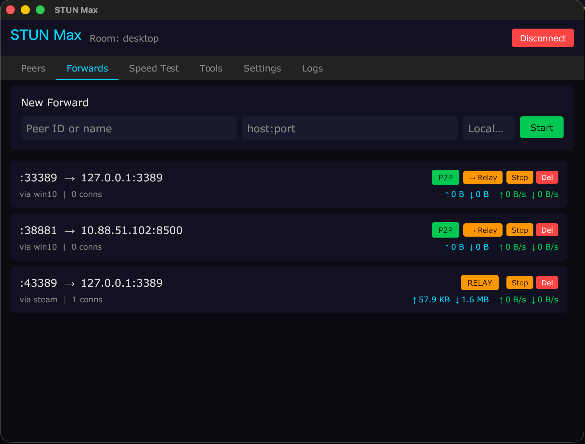
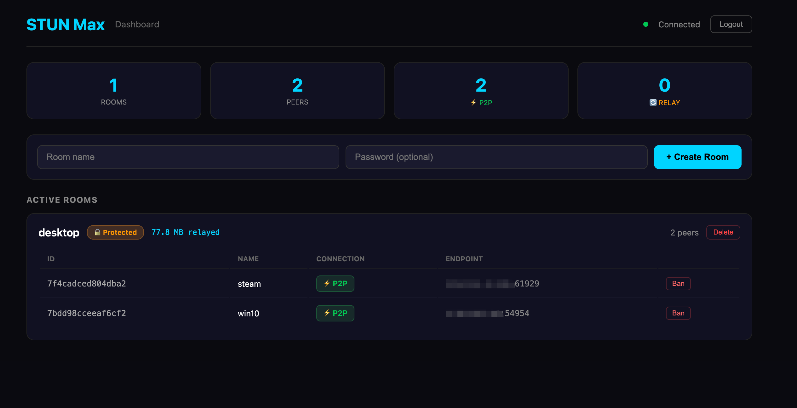

# STUN Max

P2P TCP tunnel with STUN hole punching and automatic server relay fallback. Cross-platform GUI + CLI.

## Architecture

```
┌──────────┐    1. UDP hole punch     ┌──────────┐
│ Client A │◄ ─ ─ ─ ─ ─ ─ ─ ─ ─ ─ ─►│ Client B │
│ (GUI/CLI)│    2. Direct TCP upgrade  │ (GUI/CLI)│
│          │◄═════════════════════════►│          │
└────┬─────┘    (reliable, fast)       └────┬─────┘
     │                                      │
     │  WebSocket (signaling + relay)       │
     └──────────────┬───────────────────────┘
                    │
             ┌──────┴──────┐
             │   Server    │
             │ Signal+Relay│
             │ + Dashboard │
             └─────────────┘
```

**How it works:**
1. Both clients connect to the signal server via WebSocket
2. STUN discovery finds each client's public IP:port
3. UDP hole punch establishes NAT traversal
4. Direct TCP connection upgrades the punched hole (reliable + ordered)
5. Tunnel data flows over Direct TCP (P2P) — no server in the path
6. If punch fails → automatic fallback to WebSocket relay through server

**LAN optimization:** Clients on the same public IP auto-detect and connect via local address directly.

## Screenshots




## Quick Start

### 1. Deploy Server

#### Quick Run (test)

```bash
./build.sh
./build/stun_max-server-linux-amd64 --addr :8080 --web-dir ./build/web
# Password printed to console
```

#### Production Deploy (systemd)

```bash
# Build on local machine
./build.sh

# Upload to server
scp build/stun_max-server-linux-amd64 root@YOUR_SERVER:/usr/local/bin/stun_max-server
scp build/stun_max-stunserver-linux-amd64 root@YOUR_SERVER:/usr/local/bin/stun_max-stunserver
ssh root@YOUR_SERVER "mkdir -p /opt/stun_max/web"
scp -r build/web/* root@YOUR_SERVER:/opt/stun_max/web/
```

Create systemd service:

```bash
cat > /etc/systemd/system/stun-max.service << 'EOF'
[Unit]
Description=STUN Max Signal Server
After=network.target

[Service]
Type=simple
ExecStart=/usr/local/bin/stun_max-server --addr :8080 --web-dir /opt/stun_max/web
WorkingDirectory=/opt/stun_max
Restart=always
RestartSec=3
LimitNOFILE=65536

[Install]
WantedBy=multi-user.target
EOF

systemctl daemon-reload
systemctl enable stun-max
systemctl start stun-max
```

View the auto-generated dashboard password:

```bash
journalctl -u stun-max | grep Password
```

Optional: deploy STUN server (improves hole punch, especially in China):

```bash
cat > /etc/systemd/system/stun-max-stun.service << 'EOF'
[Unit]
Description=STUN Max - STUN Server
After=network.target

[Service]
Type=simple
ExecStart=/usr/local/bin/stun_max-stunserver --addr :3478
Restart=always
RestartSec=3

[Install]
WantedBy=multi-user.target
EOF

systemctl daemon-reload
systemctl enable stun-max-stun
systemctl start stun-max-stun
```

#### Firewall

| Port | Protocol | Service |
|------|----------|---------|
| 8080 | TCP | Signal server (WebSocket + Dashboard) |
| 3478 | UDP | STUN server (optional) |

```bash
ufw allow 8080/tcp
ufw allow 3478/udp
```

#### Create a Room

Rooms must be created via the dashboard before clients can join.

Open `http://YOUR_SERVER:8080`, login with the password, create a room with name + password.



### 2. Connect Clients

**GUI** (Windows/Mac):
```
stun_max-client-windows-amd64.exe
stun_max-client-darwin-arm64
```
Enter server URL (`ws://YOUR_SERVER:8080/ws`), room name, password, your name → Connect.

Connection config is saved automatically and restored on next launch.

**CLI**:
```bash
./stun_max-cli --server ws://YOUR_SERVER:8080/ws --room myroom --password secret --name laptop
```

### 3. Port Forward

Once two clients are in the same room:

```
# GUI: Forwards tab → enter peer name, host:port, click Start
# CLI:
> forward peer-name 127.0.0.1:8080
> forward peer-name 192.168.1.100:3389 3389
> forwards    # list active
> unforward 3389
```

Forwards have Stop (pause, keeps config) and Delete (remove permanently).
Saved forwards auto-restore on reconnect.

### 4. NAT Diagnostic

```bash
./natcheck
```

Shows NAT type, hole punch success probability, peer compatibility matrix.

## Build

```bash
# All platforms
./build.sh

# Single target
go build ./server/                           # server
go build ./client/                           # GUI client
go build -tags cli ./client/                 # CLI client
go build ./tools/natcheck/                   # NAT checker
go build ./tools/stunserver/                 # STUN server
```

## CLI Commands

| Command | Description |
|---------|-------------|
| `peers` | List peers with P2P/RELAY status |
| `forward <peer> <host:port> [local]` | Forward remote port to local |
| `unforward <port>` | Stop a forward |
| `forwards` | List active forwards with traffic stats |
| `stun` | Show STUN/P2P status |
| `speedtest <peer>` | Run speed test |
| `help` | Show help |
| `quit` | Disconnect |

Tab completion for commands, peer names, and port numbers.

## GUI Tabs

| Tab | Features |
|-----|----------|
| Peers | Live peer list, P2P/RELAY status, STUN endpoints |
| Forwards | Create/stop/delete forwards, real-time traffic (bytes + rate), relay fallback |
| Speed Test | Upload/download speed test between peers |
| Tools | Windows RDP: enable/disable 3389 (localhost-only firewall), password management |
| Settings | Allow incoming forwards, local-only mode, STUN server selector, autostart (Windows) |
| Logs | Scrollable event log |

## Server Dashboard

Web dashboard at `http://SERVER:PORT` (password protected):
- Room management: create, delete
- Peer monitoring: status, endpoints, traffic per room
- Blacklist: ban/unban clients per room
- Traffic statistics and active connection count

## Security

| Feature | Detail |
|---------|--------|
| Room isolation | Clients can only communicate within the same room |
| Room auth | Rooms created via dashboard only; password SHA-256 hashed |
| Relay isolation | Server verifies sender and receiver are in the same room |
| Rate limiting | Login: 5/min/IP, WebSocket: 20/min/IP, Join: 10/min/client |
| Connection limit | Global max connections (default 5000, configurable) |
| Session expiry | Dashboard tokens expire after 24 hours |
| Blacklist | Ban clients per room via dashboard |
| Forward control | Per-client allow/deny incoming forwards + local-only mode |
| RDP security | Firewall restricts 3389 to 127.0.0.1 only |
| IP handling | X-Forwarded-For not trusted (prevents rate limit bypass) |

## Server Flags

| Flag | Default | Description |
|------|---------|-------------|
| `--addr` | `:8080` | Listen address |
| `--web-password` | (random) | Dashboard password |
| `--web-dir` | `../web` | Web static files path |
| `--max-connections` | `5000` | Max WebSocket connections |

## Client Flags (CLI)

| Flag | Default | Description |
|------|---------|-------------|
| `--server` | `ws://localhost:8080/ws` | Server WebSocket URL |
| `--room` | (required) | Room name |
| `--password` | | Room password |
| `--name` | (hostname) | Display name |
| `--stun` | `stun.cloudflare.com:3478` | STUN server(s), comma-separated |
| `--no-stun` | `false` | Disable STUN, relay only |
| `-v` | `false` | Verbose logging |

## Project Structure

```
server/
  main.go          HTTP/WS server, auth, rate limiting, connection limits
  hub.go           Room management, peer tracking, blacklist
  client.go        WebSocket message handling, room join validation
  relay.go         Data relay with room isolation check
  stats.go         Traffic statistics
client/
  core/
    client.go      Connection, signaling, peer management
    tunnel.go      TCP port forwarding (Direct TCP + relay fallback)
    stun.go        STUN discovery, UDP hole punch, Direct TCP upgrade
    crypto.go      X25519 ECDH + AES-256-GCM (key exchange)
    speedtest.go   Peer-to-peer speed testing
    types.go       Protocol types
    events.go      Event system for UI
  ui/
    app.go         Gio UI app, event consumer
    connect.go     Connection screen with STUN config
    dashboard.go   Tab navigation
    peers.go       Peer list panel
    forwards.go    Forward management (start/stop/delete, traffic stats)
    speedtest.go   Speed test panel
    tools.go       Windows RDP tools
    settings.go    Access control, STUN server selector, autostart
    config.go      Config persistence
    logs.go        Log viewer
  main.go          GUI entry point (Gio)
  main_cli.go      CLI entry point (readline, tab completion)
web/               Admin dashboard (HTML/JS/CSS)
tools/
  natcheck/        NAT type diagnostic tool
  stunserver/      Lightweight STUN server
```
