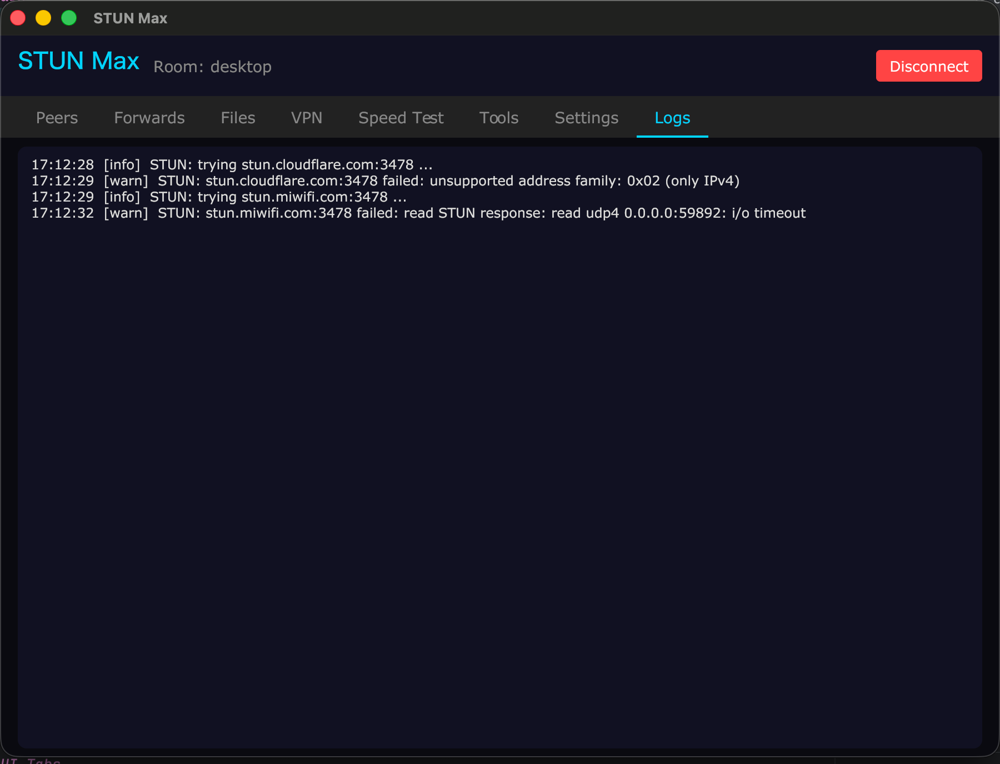
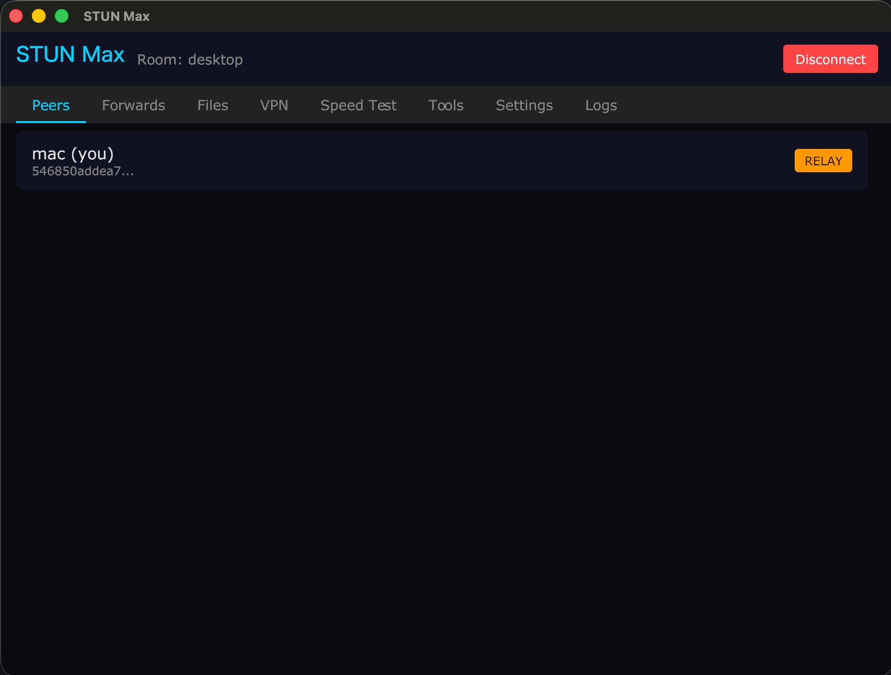
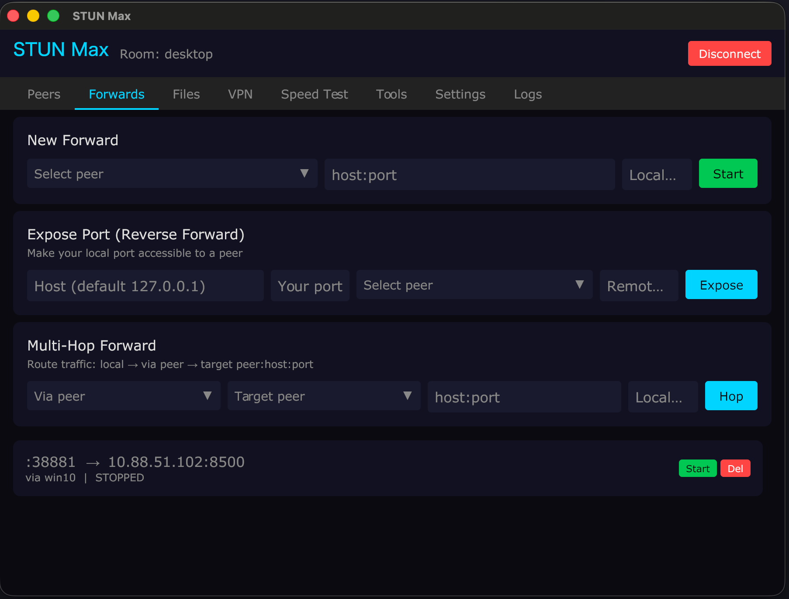
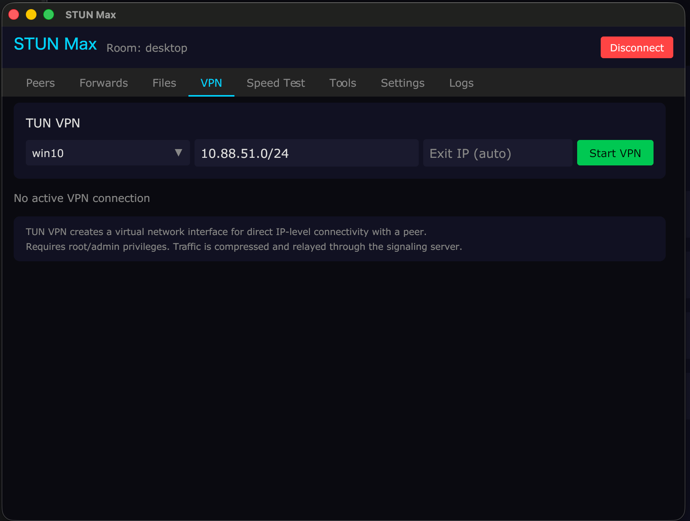
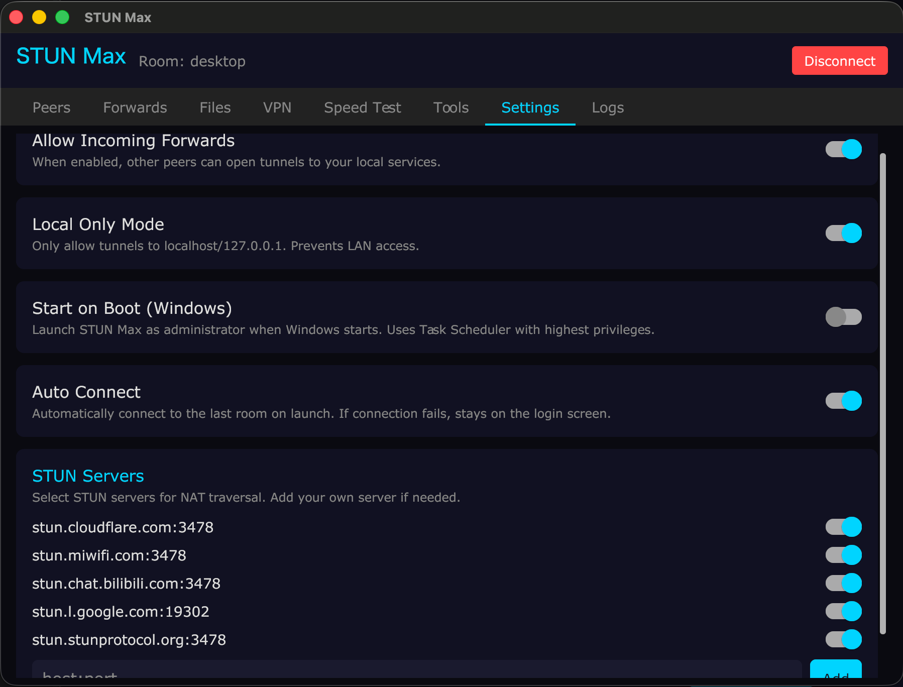
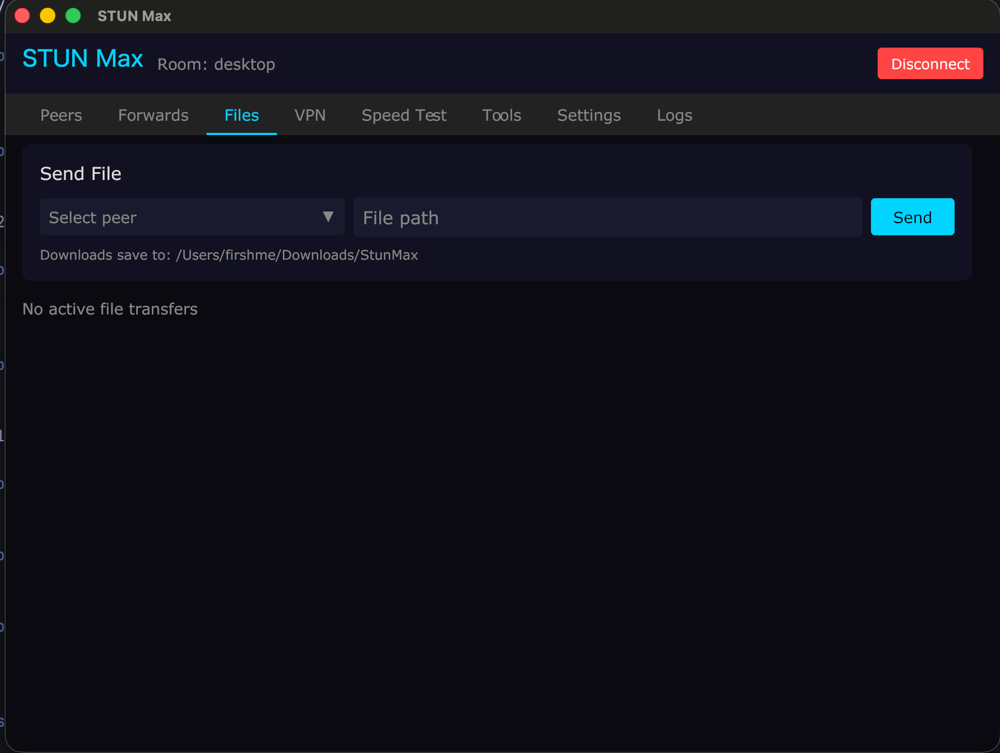

<p align="center">
  
</p>


> 微信公众号：STUN Max<br>

<p align="center">
  
</p>

<h1 align="center">STUN Max</h1>

<p align="center">
  P2P TCP tunnel with STUN hole punching and automatic server relay fallback.<br>
  Cross-platform GUI + CLI. Zero configuration networking.
</p>

---

## Features

- **P2P Direct Connection** — STUN hole punch with Birthday Attack + port prediction, data never touches the server
- **Auto Relay Fallback** — If P2P fails after 5 attempts, seamlessly falls back to server relay
- **gVisor TCP/IP Stack** — Production-grade userspace TCP (same as Tailscale/tun2socks) for VPN proxy and port forwarding
- **TUN VPN** — Full subnet routing with SNAT, TCP MSS clamping, smart compression bypass
- **Port Forwarding** — Map any remote peer's `host:port` to your localhost, with gVisor reliable transport
- **Speed Test** — P2P bandwidth test between peers with real-time progress
- **File Transfer** — Send files between peers with compression and progress tracking
- **LAN Auto-Detection** — Same public IP peers connect via local address (zero latency)
- **Auto Reconnect** — Network changes trigger automatic reconnect (3s interval, infinite retry)
- **Room-Based Access** — Password-protected rooms, created via admin dashboard only
- **GUI + CLI** — Gio UI desktop app (Windows/Mac) + readline CLI with tab completion
- **NAT Diagnostic** — Built-in `natcheck` tool detects NAT type and punch success probability
- **Config Persistence** — Connection, forwards, STUN servers saved and restored across restarts
- **Traffic Stats** — Real-time upload/download speed and total bytes per forward
- **Self-Hosted STUN** — Lightweight STUN server included for restricted networks

<!-- PLACEHOLDER_README_PART2 -->

## Architecture

```
┌──────────┐    1. UDP hole punch       ┌──────────┐
│ Client A │◄ ─ ─ ─ ─ ─ ─ ─ ─ ─ ─ ─ ─ ►│ Client B │
│ (GUI/CLI)│    2. P2P UDP direct       │ (GUI/CLI)│
│          │◄══════════════════════════►│          │
└────┬─────┘    (gVisor TCP/IP stack)   └────┬─────┘
     │                                       │
     │   WebSocket (signaling + relay)       │
     └───────────────┬───────────────────────┘
                     │
              ┌──────┴──────┐
              │   Server    │
              │ Signal+Relay│
              │ + Dashboard │
              └─────────────┘
```

**Connection flow:**

1. Both clients connect to signal server via WebSocket
2. STUN discovery finds public IP:port (supports custom/self-hosted STUN)
3. UDP hole punch with Birthday Attack + port prediction
4. Data flows over P2P UDP — server not in the data path
5. gVisor userspace TCP/IP stack handles congestion control, retransmission, SACK
6. If punch fails 5 times → auto relay, background retry continues
7. If P2P later succeeds → auto upgrade back from relay

## Screenshots

| Dashboard | GUI - Connect |
|-----------|---------------|
|  |  |

| GUI - Logs             | GUI - Peers |
|------------------------|-------------|
|  |  |

| GUI - Forwards | GUI - TUN VPN |
|----------------|---------------|
|  |  |

| GUI - Settings | GUI - Files |
|----------------|-------------|
|  |  |


## Quick Start

### 1. Deploy Server

```bash
./build.sh

# Upload to your server
scp build/stun_max-server-linux-amd64 root@SERVER:/usr/local/bin/stun_max-server
scp build/stun_max-stunserver-linux-amd64 root@SERVER:/usr/local/bin/stun_max-stunserver
ssh root@SERVER "mkdir -p /opt/stun_max/web"
scp -r build/web/* root@SERVER:/opt/stun_max/web/
```

Create systemd services:

```bash
# Signal Server
cat > /etc/systemd/system/stun-max.service << 'EOF'
[Unit]
Description=STUN Max Signal Server
After=network.target

[Service]
Type=simple
ExecStart=/usr/local/bin/stun_max-server --addr :8080 --web-dir /opt/stun_max/web
Restart=always
RestartSec=3
LimitNOFILE=65536

[Install]
WantedBy=multi-user.target
EOF

# STUN Server (optional, recommended for restricted networks)
cat > /etc/systemd/system/stun-max-stun.service << 'EOF'
[Unit]
Description=STUN Max STUN Server
After=network.target

[Service]
Type=simple
ExecStart=/usr/local/bin/stun_max-stunserver --addr :3478
Restart=always

[Install]
WantedBy=multi-user.target
EOF

systemctl daemon-reload
systemctl enable --now stun-max stun-max-stun
```

Get the auto-generated dashboard password:

```bash
journalctl -u stun-max | grep Password
```

**Firewall:** Open TCP `8080` and UDP `3478`.

### 2. Create a Room

Open `http://SERVER:8080`, login, create a room with name + password.

### 3. Connect

**GUI (Windows/Mac):**

Run `stun_max-client-windows-amd64.exe` or `stun_max-client-darwin-arm64`, fill in server URL, room, password, name → Connect.

**CLI:**

```bash
./stun_max-cli --server ws://SERVER:8080/ws --room myroom --password secret --name laptop
```

### 4. Port Forwarding

```bash
# Forward peer's port to local
> forward peer-name 127.0.0.1:3389
> forward peer-name 192.168.1.100:8080 9090

# Manage
> forwards          # list with traffic stats
> unforward 3389    # stop
```

### 5. TUN VPN (Subnet Routing)

```bash
# Route a remote subnet through peer
> vpn peer-name 192.168.1.0/24
> vpn peer-name 192.168.1.0/24 --exit-ip 192.168.1.1

# Check status
> vpn status

# Stop
> vpn stop
```

### 6. Speed Test

```bash
> speedtest peer-name          # default 10MB, auto mode
> speedtest peer-name 50       # 50MB test
> speedtest peer-name 10 p2p   # force P2P transport
```

### 7. File Transfer

```bash
> send peer-name /path/to/file
> transfers                     # list active transfers
```

## Build

```bash
./build.sh                                    # all platforms
go build ./server/                            # server only
go build ./client/                            # GUI client
go build -tags cli ./client/                  # CLI client
go build ./tools/natcheck/                    # NAT diagnostic
go build ./tools/stunserver/                  # STUN server
```

## CLI Commands

| Command | Description |
|---------|-------------|
| `peers` | List peers with P2P/RELAY mode |
| `forward <peer> <host:port> [local]` | Forward remote port |
| `unforward <port>` | Stop forward |
| `forwards` | List forwards with traffic stats |
| `expose <host:port> <peer> [port]` | Reverse forward (expose local service) |
| `stun` | STUN/P2P connection details |
| `speedtest <peer> [size] [p2p\|relay]` | Bandwidth test |
| `send <peer> <file>` | Send file to peer |
| `transfers` | List file transfers |
| `vpn <peer> [subnets...] [--exit-ip IP]` | Start TUN VPN |
| `vpn status` | VPN status with traffic |
| `vpn stop` | Stop VPN |
| `hop <peer-b> <peer-c> <host:port>` | Multi-hop forward via B to C |
| `help` | All commands |
| `quit` | Disconnect |

Tab completion for commands, peer names, and ports.

## GUI Tabs

| Tab | Description |
|-----|-------------|
| **Peers** | Peer list with P2P/RELAY badges, STUN endpoints |
| **Forwards** | Create/stop forwards, live traffic (bytes + speed), peer dropdown selector |
| **VPN** | Start/stop TUN VPN, subnet routing, traffic stats |
| **Speed Test** | P2P bandwidth test with progress bar and transport display |
| **Files** | Send/receive files with progress |
| **Settings** | Forward control, STUN server selector, autostart, auto-connect |
| **Logs** | Scrollable event log with severity colors |

## Security

| Feature | Detail |
|---------|--------|
| E2E encryption | X25519 + AES-256-GCM for all P2P and relay data |
| Room isolation | Relay verifies sender and receiver in same room |
| Room auth | Dashboard-only creation, SHA-256 password hash |
| Rate limiting | Login 5/min, WebSocket 20/min, Join 10/min per IP |
| Connection limit | Global max (default 5000, `--max-connections`) |
| Session expiry | Dashboard tokens expire after 24 hours |
| Blacklist | Ban/unban clients per room |
| Forward control | Per-client allow/deny + local-only mode |

## Server Flags

| Flag | Default | Description |
|------|---------|-------------|
| `--addr` | `:8080` | Listen address |
| `--web-password` | (random) | Dashboard password |
| `--web-dir` | `../web` | Static files path |
| `--max-connections` | `5000` | Max WebSocket connections |
| `--tls-cert` | | TLS certificate file |
| `--tls-key` | | TLS key file |

## Client Flags (CLI)

| Flag | Default | Description |
|------|---------|-------------|
| `--server` | `ws://localhost:8080/ws` | Server URL |
| `--room` | (required) | Room name |
| `--password` | | Room password |
| `--name` | (hostname) | Display name |
| `--stun` | `stun.cloudflare.com:3478` | STUN servers (comma-separated) |
| `--no-stun` | `false` | Relay only |
| `-v` | `false` | Verbose |

## Project Structure

```
server/                  Signal + relay + dashboard
  main.go                HTTP/WS, auth, rate limiting, TLS
  hub.go                 Rooms, peers, blacklist
  client.go              Message routing, join validation

client/core/             Networking (shared by GUI + CLI)
  client.go              Connection, reconnect, signaling
  tunnel.go              Port forwarding with gVisor transport
  forward_netstack.go    Per-peer gVisor TCP/IP stack for forwards
  tun.go                 TUN VPN device, SNAT, MSS clamping
  tun_netstack.go        gVisor TCP/IP stack for VPN subnet proxy
  tun_proxy.go           Legacy ICMP proxy (raw socket)
  tun_config_*.go        Platform-specific TUN setup (darwin/linux/windows)
  stun.go                STUN discovery, hole punch, UDP read loop
  speedtest.go           P2P bandwidth testing
  crypto.go              X25519 + AES-256-GCM key exchange
  compress.go            Deflate compression with smart bypass
  udp_reliable.go        RUTP reliable UDP (legacy, used by old tunnels)
  types.go               Protocol types
  events.go              Event system

client/ui/               Gio UI desktop app
  app.go                 Window, events, auto-connect
  connect.go             Login screen
  dashboard.go           Tab navigation
  peers.go               Peer list
  forwards.go            Forward management with traffic stats
  vpn.go                 TUN VPN control
  speedtest.go           Speed test with P2P mode
  files.go               File transfer
  peer_selector.go       Dropdown peer selector with P2P/RELAY badge
  settings.go            Settings + STUN selector
  config.go              Config persistence
  logs.go                Event log viewer

web/                     Admin dashboard (HTML/JS/CSS)
tools/natcheck/          NAT type diagnostic
tools/stunserver/        Self-hosted STUN server
```

## License

AGPL-3.0 — See [LICENSE](LICENSE) for details.
